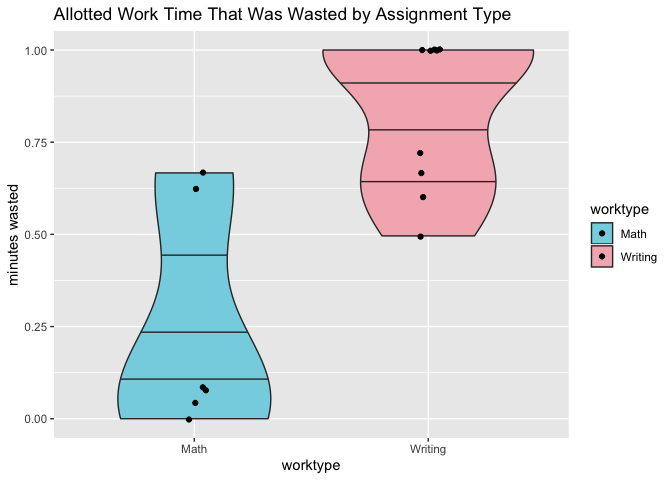

Diary of a Data Science Student: How to Avoid Dog Days
======================================================

Questions of Interest
---------------------

1.  **Generally, how am I spending my time in quarantine?**

2.  Recently, I have been thinking about how to maximize my
    productivity. In the past, I have observed that while I give myself
    a lot of time to work on an assignment, I do not make use of the
    entire chunk of time, especially if it is far away from my deadline.
    However, on days closer to a deadline, I always do more work. This
    has led me to wonder, **does the proportion of the allotted time
    that I am actually working increase as I get closer to a deadline?**
    Either way, **I want to map my work flow so I know when to give
    myself the most time when I feel motivated to work.** Maybe working
    closer to the deadline is just my natural work flow and in the
    future, I should plan for more work time closer to the deadline.

3.  **I am also wondering what conditions allow me to be more
    productive.** How does the type of assignment (math homework or
    essay writing) affect my productivity levels? I also tend to work
    either at my desk or on my bed. How does the work area (bed or desk)
    affect my productivity level?

Data Collection
---------------

I collected data by logging in my daily schedule into Google Calendar.
Every morning for two weeks, I logged in my day’s planned activities and
stuck to the schedule (for the most part). So, each day I planned set
times to do my writing or math assignments or sometimes both. In the
dataset, the *allottedtime* variable tracks the amount of time I gave
myself each day. I also logged what I was doing in the rest of the day.

At the end of each work session, I looked at my search history on Google
Chrome and calculated the total amount of time that I was on other sites
not related to my work, such as Youtube or social media. I put this into
my google calendar as part of the summary. When I’m working, the
majority of the time that I get distracted is from the Internet, so my
search history was an accurate reflection of all the time that I wasted.
The *timewasted* variable tracks the amount of time per work session
that was spent off task. I also kept track of where I was working
(*studyarea*) and the assignment type (*worktype*).

After collecting my data, I downloaded my calendar as a .ics file and
began wrangling. There are two datasets: productivitydata, which
contains the variables related to my work sessions, and the more general
activitydata, which contains all the activities that I have done in
quarantine.

Here is a view of my activity data set:

    head(allactivities)

    ##   summary               start                 end      start_datetime
    ## 1    Free 2020-04-18 21:00:00 2020-04-19 01:00:00 2020-04-18 21:00:00
    ## 2  Violin 2020-04-18 20:00:00 2020-04-18 21:00:00 2020-04-18 20:00:00
    ## 3    Free 2020-04-19 13:00:00 2020-04-19 15:00:00 2020-04-19 13:00:00
    ## 4    Work 2020-04-19 15:00:00 2020-04-19 16:30:00 2020-04-19 15:00:00
    ## 5    Free 2020-04-19 16:30:00 2020-04-19 17:00:00 2020-04-19 16:30:00
    ## 6    Free 2020-04-19 21:30:00 2020-04-20 00:00:00 2020-04-19 21:30:00
    ##          end_datetime length_sec length_min length_hrs       date daysleft
    ## 1 2020-04-19 01:00:00 14400 secs   240 secs   4.0 secs 2020-04-18       NA
    ## 2 2020-04-18 21:00:00  3600 secs    60 secs   1.0 secs 2020-04-18       NA
    ## 3 2020-04-19 15:00:00  7200 secs   120 secs   2.0 secs 2020-04-19       NA
    ## 4 2020-04-19 16:30:00  5400 secs    90 secs   1.5 secs 2020-04-19       NA
    ## 5 2020-04-19 17:00:00  1800 secs    30 secs   0.5 secs 2020-04-19       NA
    ## 6 2020-04-20 00:00:00  9000 secs   150 secs   2.5 secs 2020-04-19       NA
    ##   timewasted allottedtime activity hours
    ## 1      2e+07          240     Free   4.0
    ## 2      2e+07           60   Violin   1.0
    ## 3      2e+07          120     Free   2.0
    ## 4      2e+07           90     Work   1.5
    ## 5      2e+07           30     Free   0.5
    ## 6      2e+07          150     Free   2.5

Here is a view of my productivity data set:

    head(productivitydata)

    ##                                        summary               start
    ## 1 0, Actual Linear Algebra, Bed, 4 problems, 2 2020-04-19 01:00:00
    ## 2                    60, YoutubeLinear, Bed, 5 2020-04-22 23:00:00
    ## 3                   180, YoutubeEssay, Bed, 13 2020-04-23 00:00:00
    ## 4                    60, YoutubeEssay, Desk, 3 2020-04-24 00:00:00
    ## 5                     60, YoutubeEssay, Bed, 1 2020-04-26 02:00:00
    ## 6                    120, YoutubeEssay, Bed, 8 2020-04-28 01:00:00
    ##                   end      start_datetime        end_datetime length_sec
    ## 1 2020-04-19 03:00:00 2020-04-19 01:00:00 2020-04-19 03:00:00  7200 secs
    ## 2 2020-04-23 00:00:00 2020-04-22 23:00:00 2020-04-23 00:00:00  3600 secs
    ## 3 2020-04-23 03:00:00 2020-04-23 00:00:00 2020-04-23 03:00:00 10800 secs
    ## 4 2020-04-24 01:00:00 2020-04-24 00:00:00 2020-04-24 01:00:00  3600 secs
    ## 5 2020-04-26 03:00:00 2020-04-26 02:00:00 2020-04-26 03:00:00  3600 secs
    ## 6 2020-04-28 03:00:00 2020-04-28 01:00:00 2020-04-28 03:00:00  7200 secs
    ##   length_min length_hrs       date daysleft timewasted allottedtime
    ## 1   120 secs     2 secs 2020-04-19        2          0          120
    ## 2    60 secs     1 secs 2020-04-22        5         60           60
    ## 3   180 secs     3 secs 2020-04-23       13        180          180
    ## 4    60 secs     1 secs 2020-04-24        3         60           60
    ## 5    60 secs     1 secs 2020-04-26        1         60           60
    ## 6   120 secs     2 secs 2020-04-28        8        120          120
    ##   studyarea timewastedproportion worktype timeproductive
    ## 1       Bed                    0     Math            120
    ## 2       Bed                    1     Math              0
    ## 3       Bed                    1  Writing              0
    ## 4      Desk                    1  Writing              0
    ## 5       Bed                    1  Writing              0
    ## 6       Bed                    1  Writing              0
    ##   timeworkedproportion
    ## 1                    1
    ## 2                    0
    ## 3                    0
    ## 4                    0
    ## 5                    0
    ## 6                    0

Results
-------

### Question 1: Overall, how am I spending my time?

    activitiesplot <- ggplot(allactivities, aes(x=activity, fill = activity, y = hours)) + 
       geom_bar(stat = "identity") +
       scale_fill_manual(values = pal) +
      labs(title = "What I have been doing in Quarantine",
           y = "total hours")
    activitiesplot

    pal <- wes_palette("GrandBudapest2", n=4, type = "discrete")

    #Plot 1: violinplot of how much time is wasted in bed versus at the desk

    violinplot <- ggplot(productivitydata, aes(x = studyarea, y = timewasted, fill = studyarea)) +
      geom_violin(draw_quantiles = c(0.25, 0.5, 0.75)) + #geom_count()
      geom_jitter(width = 0.05) +
      scale_fill_manual(values = pal)
      labs(title = "Allotted Work Time That was Wasted by Study Area",
           y = "minutes wasted")

    ## $y
    ## [1] "minutes wasted"
    ## 
    ## $title
    ## [1] "Allotted Work Time That was Wasted by Study Area"
    ## 
    ## attr(,"class")
    ## [1] "labels"

    violinplot

    #plot2, control for amount of time spent
    violinplot2 <- ggplot(productivitydata, aes(x = studyarea, y = timewastedproportion, fill = studyarea)) +
      geom_violin(draw_quantiles = c(0.25, 0.5, 0.75)) + #geom_count()
      geom_jitter(width = 0.05) +
      scale_fill_manual(values = pal)+
      labs(title = "Proportion of Allotted Work Time that was Wasted by Study Area",
           y = "time wasted/Time Allotted")
    violinplot2

    pal <- wes_palette("Moonrise3", n=4, type = "discrete")
    #plot3, math versus writing
    violinplot3 <- ggplot(productivitydata, aes(x = worktype, y = timewasted, fill = worktype)) +
      geom_violin(draw_quantiles = c(0.25, 0.5, 0.75)) + #geom_count()
      geom_jitter(width = 0.05)+
      scale_fill_manual(values = pal)+
      labs(title = "Allotted Work Time That Was Wasted by Assignment Type",
           y = "minutes wasted")
    violinplot3

    #plot4, math versus writing controlling for differences in allotted time
    violinplot4 <- ggplot(productivitydata, aes(x = worktype, y = timewastedproportion, fill = worktype)) +
      geom_violin(draw_quantiles = c(0.25, 0.5, 0.75)) + #geom_count()
      geom_jitter(width = 0.05)+
      scale_fill_manual(values = pal)+
      labs(title = "Allotted Work Time That Was Wasted by Assignment Type",
           y = "minutes wasted")
    violinplot4

    #filter out the outlier for math
    noutliers <- productivitydata %>% filter(summary != "60, YoutubeLinear, Bed, 5")
    violinplot5 <- ggplot(noutliers, aes(x = worktype, y = timewastedproportion, fill = worktype)) +
      geom_violin(draw_quantiles = c(0.25, 0.5, 0.75)) + #geom_count()
      geom_jitter(width = 0.05)+
      scale_fill_manual(values = pal)+
      labs(title = "Allotted Work Time That Was Wasted by Assignment Type",
           y = "minutes wasted")
    violinplot5

    #time productive by worktype
    pal <- wes_palette("Darjeeling1", n=4, type = "discrete")
    violinplot6 <- ggplot(productivitydata, aes(x = worktype, y = timeproductive, fill = worktype)) +
      geom_violin(draw_quantiles = c(0.25, 0.5, 0.75)) + #geom_count()
      geom_jitter(width = 0.05)+
      scale_fill_manual(values = pal)+
      labs(title = "Allotted Work Time That Was Used by Assignment Type",
           y = "minutes wasted")
    violinplot6

    violinplot7 <- ggplot(noutliers, aes(x = worktype, y = timeworkedproportion, fill = worktype)) +
      geom_violin(draw_quantiles = c(0.25, 0.5, 0.75)) + #geom_count()
      geom_jitter(width = 0.05)+
      scale_fill_manual(values = pal)+
      labs(title = "Allotted Work Time That Was Used by Assignment Type",
           y = "minutes wasted")
    violinplot7

    #linegraph
    #manually enter missing day values
    #plot x = daysuntildeadline, y = proportionwasted
    #second layer=actual time given
    linegraph1 <- ggplot(productivitydata, aes(x = daysleft)) + 
      geom_smooth(aes(y = allottedtime), se = FALSE, fullrange = TRUE) +
      scale_x_reverse() +
      geom_ribbon(aes(ymin = 0,ymax = predict(loess(allottedtime ~ daysleft))),
                     alpha = 0.4, fill = "#bef26b")+
      geom_smooth(aes(y = timeproductive), se = FALSE, fullrange = TRUE) +
      geom_ribbon(aes(ymin = 0,ymax = predict(loess(timeproductive ~ daysleft))),
                     alpha = 1.0, fill = "#60ebe9")# +
      #transition_reveal(rev(seq_along(daysleft)))
    linegraph1

    ## `geom_smooth()` using method = 'loess' and formula 'y ~ x'
    ## `geom_smooth()` using method = 'loess' and formula 'y ~ x'

    cor(productivitydata$daysleft, productivitydata$timewastedproportion)

    ## [1] 0.4391658

1.  Create relevant summaries and visualizations, wrangling the data as
    necessary along the way. (Note: MUCH, MUCH LESS wrangling is
    expected here than in the Clearinghouse Challenge. The `ical`
    package imports the calendar data into a nicely formatted dataframe,
    with variables for summary of the event, time start, time end, and
    description.) Wrangling should *not* take a substantial amount of
    time.

2.  What insights can you glean from how you’re spending your time?
    Write a 3-5 paragraph report introducing your questions of interest,
    explaining what you found, and reflecting on the answers to your
    questions posed.

3.  Finally, write a short reflection (1-2 paragraphs) on the process.
    As someone who provides data: What expectations do you have when you
    give your data (e.g. to Facebook, Google, MapMyRun, etc.)? As
    someone who analyzes others’ data: What legal and ethical
    responsibilities do you have?

Data collection
===============

Results
=======

And here are my results . . .

    # intersperse relevant figures and text
