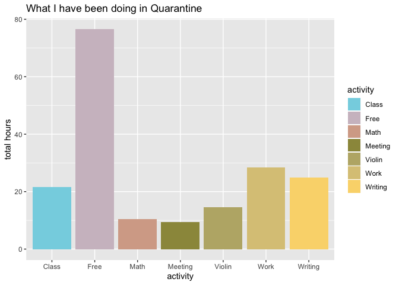

Diary of a Data Science Student: How to Avoid Lazy Dog Days
===========================================================

Questions of Interest
---------------------

1.  How am I spending my time in quarantine?

2.  Recently, I have been thinking about how to maximize my
    productivity. In the past, I have observed that while I give myself
    a lot of time to work on an assignment, I do not make use of the
    entire chunk of time, especially if it is far away from my deadline.
    However, on days closer to a deadline, I always do more work. This
    has led me to wonder, **does the proportion of the allotted time
    that I am actually working increase as I get closer to a deadline?**
    Either way, **I want to map my work flow so I know when to give
    myself the most time when I feel motivated to work.** Maybe working
    closer to the deadline is just my natural work flow and in the
    future, I should plan for more work time closer to the deadline.

3.  **I am also wondering what conditions allow me to be more
    productive.** How does the type of assignment (math homework or
    essay writing) affect my productivity levels? I also tend to work
    either at my desk or on my bed. How does the work area (bed or desk)
    affect my productivity level?

Data Collection
---------------

I collected data by logging in my daily schedule into Google Calendar.
Every morning for two weeks, I logged in my day’s planned activities and
stuck to the schedule (for the most part). So, each day I planned set
times to do my writing or math assignments or sometimes both. In the
dataset, the *allottedtime* variable tracks the amount of time I gave
myself each day. I also logged what I was doing in the rest of the day.

At the end of each work session, I looked at my search history on Google
Chrome and calculated the total amount of time that I was on other sites
not related to my work, such as Youtube or social media. I put this into
my google calendar as part of the summary. When I’m working, the
majority of the time that I get distracted is from the Internet, so my
search history was an accurate reflection of all the time that I wasted.
The *timewasted* variable tracks the amount of time per work session
that was spent off task. I also kept track of where I was working
(*studyarea*) and the assignment type (*worktype*).

After collecting my data, I downloaded my calendar as a .ics file and
began wrangling. There are two datasets: productivitydata, which
contains the variables related to my work sessions, and the more general
activitydata, which contains all the activities that I have done in
quarantine.

    ## ── Attaching packages ─────────────────────────────────────── tidyverse 1.3.0 ──

    ## ✔ ggplot2 3.2.1     ✔ purrr   0.3.3
    ## ✔ tibble  2.1.3     ✔ dplyr   0.8.3
    ## ✔ tidyr   1.0.0     ✔ stringr 1.4.0
    ## ✔ readr   1.3.1     ✔ forcats 0.4.0

    ## ── Conflicts ────────────────────────────────────────── tidyverse_conflicts() ──
    ## ✖ dplyr::filter() masks stats::filter()
    ## ✖ dplyr::lag()    masks stats::lag()

    ## 
    ## Attaching package: 'lubridate'

    ## The following object is masked from 'package:base':
    ## 
    ##     date

    ## 'data.frame':    117 obs. of  12 variables:
    ##  $ summary       : Factor w/ 87 levels " 216, Actual Essay, Desk, 313 Words, Quality 3, 2",..: 49 79 49 80 49 49 19 79 23 49 ...
    ##  $ start         : POSIXct, format: "2020-04-18 21:00:00" "2020-04-18 20:00:00" ...
    ##  $ end           : POSIXct, format: "2020-04-19 01:00:00" "2020-04-18 21:00:00" ...
    ##  $ start_datetime: POSIXct, format: "2020-04-18 21:00:00" "2020-04-18 20:00:00" ...
    ##  $ end_datetime  : POSIXct, format: "2020-04-19 01:00:00" "2020-04-18 21:00:00" ...
    ##  $ length_sec    : 'difftime' num  14400 3600 7200 5400 ...
    ##   ..- attr(*, "units")= chr "secs"
    ##  $ length_min    : 'difftime' num  240 60 120 90 ...
    ##   ..- attr(*, "units")= chr "secs"
    ##  $ length_hrs    : 'difftime' num  4 1 2 1.5 ...
    ##   ..- attr(*, "units")= chr "secs"
    ##  $ date          : POSIXct, format: "2020-04-18" "2020-04-18" ...
    ##  $ daysleft      : num  NA NA NA NA NA NA NA NA NA NA ...
    ##  $ timewasted    : num  2e+07 2e+07 2e+07 2e+07 2e+07 2e+07 2e+07 2e+07 2e+07 2e+07 ...
    ##  $ allottedtime  : num  240 60 120 90 30 150 30 90 150 60 ...

    library(wesanderson)
    pal <- wes_palette("GrandBudapest2", n=4, type = "discrete")

    #Plot 1: violinplot of how much time is wasted in bed versus at the desk

    productivitydata <- mycal %>% filter(timewasted != 20000000) %>%
      mutate("studyarea" = case_when(grepl("Bed", summary, ignore.case = TRUE) ~  "Bed",
                                         grepl("desk", summary, ignore.case = TRUE) ~  "Desk",
                                         TRUE ~ "whatever"),
                                         "timewastedproportion" = timewasted/allottedtime,
                                         "worktype" = case_when(grepl("Linear", summary, ignore.case = TRUE) ~ "Math",
                                                                grepl("Essay", summary, ignore.case = TRUE) ~ "Writing",
                                                                TRUE ~ "whatever"))

    #manually entering some missing values
    productivitydata$daysleft[14] <- 0
    productivitydata$daysleft[16] <- 4
    productivitydata$daysleft[3] <- 13
    productivitydata$daysleft[11] <- 14
    productivitydata <- productivitydata %>% 
      mutate("timeproductive" = (allottedtime - timewasted)) %>%
      mutate("timeworkedproportion" = timeproductive/allottedtime)

    violinplot <- ggplot(productivitydata, aes(x = studyarea, y = timewasted, fill = studyarea)) +
      geom_violin(draw_quantiles = c(0.25, 0.5, 0.75)) + #geom_count()
      geom_jitter(width = 0.05) +
      scale_fill_manual(values = pal)
      labs(title = "Allotted Work Time That was Wasted by Study Area",
           y = "minutes wasted")

    ## $y
    ## [1] "minutes wasted"
    ## 
    ## $title
    ## [1] "Allotted Work Time That was Wasted by Study Area"
    ## 
    ## attr(,"class")
    ## [1] "labels"

    violinplot

    #plot2, control for amount of time spent
    violinplot2 <- ggplot(productivitydata, aes(x = studyarea, y = timewastedproportion, fill = studyarea)) +
      geom_violin(draw_quantiles = c(0.25, 0.5, 0.75)) + #geom_count()
      geom_jitter(width = 0.05) +
      scale_fill_manual(values = pal)+
      labs(title = "Proportion of Allotted Work Time that was Wasted by Study Area",
           y = "time wasted/Time Allotted")
    violinplot2

    pal <- wes_palette("Moonrise3", n=4, type = "discrete")
    #plot3, math versus writing
    violinplot3 <- ggplot(productivitydata, aes(x = worktype, y = timewasted, fill = worktype)) +
      geom_violin(draw_quantiles = c(0.25, 0.5, 0.75)) + #geom_count()
      geom_jitter(width = 0.05)+
      scale_fill_manual(values = pal)+
      labs(title = "Allotted Work Time That Was Wasted by Assignment Type",
           y = "minutes wasted")
    violinplot3

    #plot4, math versus writing controlling for differences in allotted time
    violinplot4 <- ggplot(productivitydata, aes(x = worktype, y = timewastedproportion, fill = worktype)) +
      geom_violin(draw_quantiles = c(0.25, 0.5, 0.75)) + #geom_count()
      geom_jitter(width = 0.05)+
      scale_fill_manual(values = pal)+
      labs(title = "Allotted Work Time That Was Wasted by Assignment Type",
           y = "minutes wasted")
    violinplot4

    #filter out the outlier for math
    noutliers <- productivitydata %>% filter(summary != "60, YoutubeLinear, Bed, 5")
    violinplot5 <- ggplot(noutliers, aes(x = worktype, y = timewastedproportion, fill = worktype)) +
      geom_violin(draw_quantiles = c(0.25, 0.5, 0.75)) + #geom_count()
      geom_jitter(width = 0.05)+
      scale_fill_manual(values = pal)+
      labs(title = "Allotted Work Time That Was Wasted by Assignment Type",
           y = "minutes wasted")
    violinplot5

    #time productive by worktype
    pal <- wes_palette("Darjeeling1", n=4, type = "discrete")
    violinplot6 <- ggplot(productivitydata, aes(x = worktype, y = timeproductive, fill = worktype)) +
      geom_violin(draw_quantiles = c(0.25, 0.5, 0.75)) + #geom_count()
      geom_jitter(width = 0.05)+
      scale_fill_manual(values = pal)+
      labs(title = "Allotted Work Time That Was Used by Assignment Type",
           y = "minutes wasted")
    violinplot6

    violinplot7 <- ggplot(noutliers, aes(x = worktype, y = timeworkedproportion, fill = worktype)) +
      geom_violin(draw_quantiles = c(0.25, 0.5, 0.75)) + #geom_count()
      geom_jitter(width = 0.05)+
      scale_fill_manual(values = pal)+
      labs(title = "Allotted Work Time That Was Used by Assignment Type",
           y = "minutes wasted")
    violinplot7

    #linegraph
    #manually enter missing day values
    #plot x = daysuntildeadline, y = proportionwasted
    #second layer=actual time given
    linegraph1 <- ggplot(productivitydata, aes(x = daysleft)) + 
      geom_smooth(aes(y = allottedtime), se = FALSE, fullrange = TRUE) +
      scale_x_reverse() +
      geom_ribbon(aes(ymin = 0,ymax = predict(loess(allottedtime ~ daysleft))),
                     alpha = 0.4, fill = "#bef26b")+
      geom_smooth(aes(y = timeproductive), se = FALSE, fullrange = TRUE) +
      geom_ribbon(aes(ymin = 0,ymax = predict(loess(timeproductive ~ daysleft))),
                     alpha = 1.0, fill = "#60ebe9")# +
      #transition_reveal(rev(seq_along(daysleft)))
    linegraph1

    ## `geom_smooth()` using method = 'loess' and formula 'y ~ x'
    ## `geom_smooth()` using method = 'loess' and formula 'y ~ x'

    cor(productivitydata$daysleft, productivitydata$timewastedproportion)

    ## [1] 0.4391658

\#Question 1: What am I doing with my time overall?

    allactivities <- mycal %>% 
      filter(!(str_detect(summary, "Youtube") | str_detect(summary, "Actual")), 
             summary != "120, Essay, Bed, 14") %>%
      mutate("activity" = case_when(grepl("Linear", summary, ignore.case = TRUE) ~ "Math",
                            grepl("Essay", summary, ignore.case = TRUE) ~ "Writing",
                            (summary %in% c("Class", "Classes")) ~ "Class",
                            (summary %in% c("Free", "Janet", "Allison", "Cleo")) ~ "Free",
                            (summary %in% c("Call", "Meeting")) ~ "Meeting",
                            summary == "Work" ~ "Work",
                            summary == "Violin" ~ "Violin",
                            TRUE ~ "Meeting"),
             "hours" = as.numeric(length_hrs))

    pal <- wes_palette("Moonrise3", n=7, type = "continuous")

    activitiesgif <- ggplot(allactivities, aes(x=activity, fill = activity, y = hours)) + 
       geom_bar(stat = "identity") +
       scale_fill_manual(values = pal)+
       transition_states(
        date,
        transition_length = 2,
        state_length = 1) +
       ease_aes('sine-in-out') +
      labs(title = "{closest_state}")

    anim_save("activities.gif", activitiesgif)

    activitiesplot <- ggplot(allactivities, aes(x=activity, fill = activity, y = hours)) + 
       geom_bar(stat = "identity") +
       scale_fill_manual(values = pal) +
      labs(title = "What I have been doing in Quarantine",
           y = "total hours")
    activitiesplot

1.  Create relevant summaries and visualizations, wrangling the data as
    necessary along the way. (Note: MUCH, MUCH LESS wrangling is
    expected here than in the Clearinghouse Challenge. The `ical`
    package imports the calendar data into a nicely formatted dataframe,
    with variables for summary of the event, time start, time end, and
    description.) Wrangling should *not* take a substantial amount of
    time.

2.  What insights can you glean from how you’re spending your time?
    Write a 3-5 paragraph report introducing your questions of interest,
    explaining what you found, and reflecting on the answers to your
    questions posed.

3.  Finally, write a short reflection (1-2 paragraphs) on the process.
    As someone who provides data: What expectations do you have when you
    give your data (e.g. to Facebook, Google, MapMyRun, etc.)? As
    someone who analyzes others’ data: What legal and ethical
    responsibilities do you have?

Data collection
===============

Results
=======

And here are my results . . .

    # intersperse relevant figures and text
