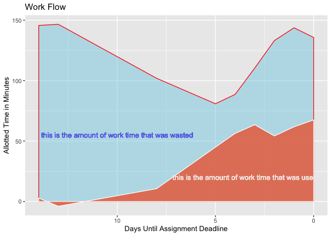

Diary of a Data Science Student: How to Avoid Dog Days
======================================================

Questions of Interest
---------------------

1.  **Generally, how am I spending my time in quarantine?**

2.  Recently, I have been thinking about how to maximize my
    productivity. In the past, I have observed that while I give myself
    a lot of time to work on an assignment, I do not make use of the
    entire chunk of time, especially if it is far away from my deadline.
    However, on days closer to a deadline, I always do more work. This
    has led me to wonder, **does the proportion of the allotted time
    that I am actually working increase as I get closer to a deadline?**
    Either way, **I want to map my work flow so I know when to give
    myself the most time when I feel motivated to work.** Maybe working
    closer to the deadline is just my natural work flow and in the
    future, I should plan for more work time closer to the deadline.

3.  **I am also wondering what conditions allow me to be more
    productive.** How does the type of assignment (math homework or
    essay writing) affect my productivity levels? I also tend to work
    either at my desk or on my bed. How does the work area (bed or desk)
    affect my productivity level?

Data Collection
---------------

I collected data by logging in my daily schedule into Google Calendar.
Every morning for 13 days, I logged in my day’s planned activities and
stuck to the schedule (for the most part). So, each day I planned set
times to do my writing or math assignments or sometimes both. In the
dataset, the *allottedtime* variable tracks the amount of time I gave
myself each day. I also logged what I was doing in the rest of the day.

At the end of each work session, I looked at my search history on Google
Chrome and calculated the total amount of time that I was on other sites
not related to my work, such as Youtube or social media. I put this into
my google calendar as part of the summary. When I’m working, the
majority of the time that I get distracted is from the Internet, so my
search history was an accurate reflection of all the time that I wasted.
The *timewasted* variable tracks the amount of time per work session
that was spent off task. I also kept track of where I was working
(*studyarea*) and the assignment type (*worktype*).

After collecting my data, I downloaded my calendar as a .ics file and
began wrangling. There are two datasets: productivitydata, which
contains the variables related to my work sessions, and the more general
activitydata, which contains all the activities that I have done in
quarantine.

Here is a view of my activity data set:

    head(allactivities)

    ##   summary               start                 end      start_datetime
    ## 1    Free 2020-04-18 21:00:00 2020-04-19 01:00:00 2020-04-18 21:00:00
    ## 2  Violin 2020-04-18 20:00:00 2020-04-18 21:00:00 2020-04-18 20:00:00
    ## 3    Free 2020-04-19 13:00:00 2020-04-19 15:00:00 2020-04-19 13:00:00
    ## 4    Work 2020-04-19 15:00:00 2020-04-19 16:30:00 2020-04-19 15:00:00
    ## 5    Free 2020-04-19 16:30:00 2020-04-19 17:00:00 2020-04-19 16:30:00
    ## 6    Free 2020-04-19 21:30:00 2020-04-20 00:00:00 2020-04-19 21:30:00
    ##          end_datetime length_sec length_min length_hrs       date daysleft
    ## 1 2020-04-19 01:00:00 14400 secs   240 secs   4.0 secs 2020-04-18       NA
    ## 2 2020-04-18 21:00:00  3600 secs    60 secs   1.0 secs 2020-04-18       NA
    ## 3 2020-04-19 15:00:00  7200 secs   120 secs   2.0 secs 2020-04-19       NA
    ## 4 2020-04-19 16:30:00  5400 secs    90 secs   1.5 secs 2020-04-19       NA
    ## 5 2020-04-19 17:00:00  1800 secs    30 secs   0.5 secs 2020-04-19       NA
    ## 6 2020-04-20 00:00:00  9000 secs   150 secs   2.5 secs 2020-04-19       NA
    ##   timewasted allottedtime activity hours
    ## 1      2e+07          240     Free   4.0
    ## 2      2e+07           60   Violin   1.0
    ## 3      2e+07          120     Free   2.0
    ## 4      2e+07           90     Work   1.5
    ## 5      2e+07           30     Free   0.5
    ## 6      2e+07          150     Free   2.5

Here is a view of my productivity data set:

    head(productivitydata)

    ##                                        summary               start
    ## 1 0, Actual Linear Algebra, Bed, 4 problems, 2 2020-04-19 01:00:00
    ## 2                    60, YoutubeLinear, Bed, 5 2020-04-22 23:00:00
    ## 3                   180, YoutubeEssay, Bed, 13 2020-04-23 00:00:00
    ## 4                    60, YoutubeEssay, Desk, 3 2020-04-24 00:00:00
    ## 5                     60, YoutubeEssay, Bed, 1 2020-04-26 02:00:00
    ## 6                    120, YoutubeEssay, Bed, 8 2020-04-28 01:00:00
    ##                   end      start_datetime        end_datetime length_sec
    ## 1 2020-04-19 03:00:00 2020-04-19 01:00:00 2020-04-19 03:00:00  7200 secs
    ## 2 2020-04-23 00:00:00 2020-04-22 23:00:00 2020-04-23 00:00:00  3600 secs
    ## 3 2020-04-23 03:00:00 2020-04-23 00:00:00 2020-04-23 03:00:00 10800 secs
    ## 4 2020-04-24 01:00:00 2020-04-24 00:00:00 2020-04-24 01:00:00  3600 secs
    ## 5 2020-04-26 03:00:00 2020-04-26 02:00:00 2020-04-26 03:00:00  3600 secs
    ## 6 2020-04-28 03:00:00 2020-04-28 01:00:00 2020-04-28 03:00:00  7200 secs
    ##   length_min length_hrs       date daysleft timewasted allottedtime
    ## 1   120 secs     2 secs 2020-04-19        2          0          120
    ## 2    60 secs     1 secs 2020-04-22        5         60           60
    ## 3   180 secs     3 secs 2020-04-23       13        180          180
    ## 4    60 secs     1 secs 2020-04-24        3         60           60
    ## 5    60 secs     1 secs 2020-04-26        1         60           60
    ## 6   120 secs     2 secs 2020-04-28        8        120          120
    ##   studyarea timewastedproportion worktype timeproductive
    ## 1       Bed                    0     Math            120
    ## 2       Bed                    1     Math              0
    ## 3       Bed                    1  Writing              0
    ## 4      Desk                    1  Writing              0
    ## 5       Bed                    1  Writing              0
    ## 6       Bed                    1  Writing              0
    ##   timeworkedproportion
    ## 1                    1
    ## 2                    0
    ## 3                    0
    ## 4                    0
    ## 5                    0
    ## 6                    0

Results
-------

### Question 1: Overall, how am I spending my time?

The graph below shows my daily activity breakdown over a two week
period. There is a lot variation in my daily activites! Every day looks
a little bit different.

This second plot depicts the total hours that I spent on each activity
during the two week period. I did not keep track of the time that I was
sleeping or waking up, which explains why there are less hours than
there are in two weeks.

I have a lot of free time! By a wide margin, most of the time is going
towards free time. This makes sense, because I have had a lot of free
time. Because I categorized any time spent eating, exercising, talking
with my friends, and watching films/reading as free time, there are many
different activities that add to total that is just shy of 80 hours.

At first glance, it doesn’t look like I’m spending a lot of time on
school. However, three separate categories are all school work time–if I
added up math, writing, and work, this would be about 64 hours of work
time. (The *work* category is for miscellaneous schoolwork that I am not
tracking for my productivity analysis).

### Questions 2 and 3

While I spent 24 hours writing and 15 hours doing math problems, how
much of that time was actually spent working? Often, I found myself
sitting down to begin a work session, only to fall down a self care
Youtube rabbit hole after ten minutes of focusing.

First, I wanted to explore whether the place that I worked had any
effect on my productivity level. The violin plot below depicts this. The
bands represent the quartiles while the width of the plot represents the
probability density of the data at that value.

There is a lot of variation in both categories, but more in bed than in
desk. Desk minutes wasted has an outlier, but most of the data is lower,
so the probability density is also lower. In truth, desk is the widest
at its lowest values, meaning that it is more probable for me not to
waste a lot of time (below 50 minutes) at my desk. Bed is a different
story, as it looks like the medians is around 100 wasted minutes.

But wait! Doesn’t the allotted time affect the amount of time wasted? If
I give less time to work done in my bed, wouldn’t there naturally be
less minutes wasted? To control for this, I compared the proportions of
time wasted out of the total allotted work time.

Here, we see that the distributions of proportions of work time wasted
are very similar, regardless of the area worked. Therefore, we can
eliminate the work area as a factor that has any serious effect on my
productivity.

Secondly, I looked at the amount of time wasted by assignment type. At
first glance, it looks like there is a lot of variatiion in minutes
wasted for writing assignments but not a lot for math assignments.
Additionally, there seem to be less minutes wasted overall for math than
for writing assignments. However, let’s control for proportions.

After controlling for proportions, we see that there seems to be some
difference in time wasted by assignment type. Writing assignments, while
having less variation, is predicted to always have at least 50% of the
time wasted. By this model, I am always wasting a lot of time when I
write! While math does have at least some of its probability
distribution fall in the higher end, this may be due to the outlier at
1.00.

Let’s factor out the outlier at 1.00 for math assignments. Below, we see
that the probability density of the data for math does not extend above
0.70 and that the fattest part of the probability density is around
0.1275. However, for writing, the distribution is never lower than 0.50.
While there is some overlap, I am clearly wasting more time when writing
than doing math.

    #filter out the outlier for math
    noutliers <- productivitydata %>% filter(summary != "60, YoutubeLinear, Bed, 5")
    violinplot5 <- ggplot(noutliers, aes(x = worktype, y = timewastedproportion, fill = worktype)) +
      geom_violin(draw_quantiles = c(0.25, 0.5, 0.75)) + #geom_count()
      geom_jitter(width = 0.05)+
      scale_fill_manual(values = pal)+
      labs(title = "Proportion of Allotted Work Time That Was Wasted by Assignment Type",
           y = "minutes wasted")
    violinplot5

Inversely, below is a graph of the proportion of time used by work type.
We see comparable results to above.

    pal <- wes_palette("Darjeeling1", n=2, type = "discrete")

    violinplot7 <- ggplot(noutliers, aes(x = worktype, y = timeworkedproportion, fill = worktype)) +
      geom_violin(draw_quantiles = c(0.25, 0.5, 0.75)) + 
      geom_jitter(width = 0.05)+
      scale_fill_manual(values = pal)+
      labs(title = "Allotted Work Time That Was Used by Assignment Type",
           y = "minutes wasted")
    violinplot7

Thirdly, we have a graph that depicts my natural work flow. After
averaging over the observations at each day until deadline, the graph
shows the amount of time that I’ve given myself for an assignment and
the amounnt of time that is actually used. The amount of time that is
used is in red while the amount of time wasted is in blue. Of course,
because the graph is predicting based on the observations of allotted
time and the amount of time that was productive separately, the shaded
area is not an exact replica of the proportions of time used and wasted.

    #linegraph
    #manually enter missing day values
    #plot x = daysuntildeadline, y = proportionwasted
    #second layer=actual time given
    linegraph1 <- ggplot(productivitydata, aes(x = daysleft)) + 
      #geom_smooth(aes(y = allottedtime), se = FALSE, fullrange = TRUE) +
      scale_x_reverse() +
      geom_ribbon(aes(ymin = 0,ymax = predict(loess(allottedtime ~ daysleft))),
                     alpha = 0.4, fill = "#68cae3")+
      #geom_smooth(aes(y = timeproductive), se = FALSE, fullrange = TRUE) +
      geom_ribbon(aes(ymin = 0,ymax = predict(loess(timeproductive ~ daysleft))),
                     alpha = 0.95, fill = "#e67d60")
      
    linegraph1

We see that in general, as time gets closer to the due date, I am using
more of my time. We have a correlation between the time worked and the
days until deadline of -0.4392, which means that there is a moderate
correlation between the amount of time worked and the days until the
deadline. The negative value indicates that as the number of days until
the deadline increases, the proportion of time spent working decreases,
or as deadlines draw nearer, the proportion of time spent working
increases. This confirms my original estimate.

This graph is also useful because it shows that at the beginning, I am
giving myself almost the same amount of work time as the end. Around 5
days, I give myself less work time, even though that is when the rate of
work increases. However, if I want to mirror my natural work flow, I
should begin to give myself less time prior to ten days until a
deadline, as most of that is wasted. I should give myself enough time 5
days prior to a deadline, as I am doing right now. Overall, I see that I
overestimate the amount of time it takes to accomplish an assignment, as
I am giving myself a lot more time than necessary, as I was able to
finish all the assignments in this analysis on time.
